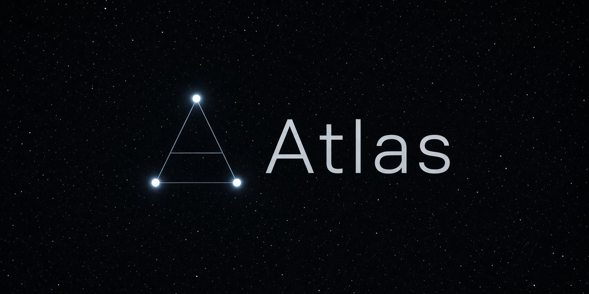

# Atlas



Looking to build a second brain for your agent or skill (yes, agents can
have skills) that follows specific structures and can be connected with
other brains?

Look no more. Atlas is a distributed Semantic Knowledge Network built with
technologies LLMs already know: git and markdown, with a SCHEMA and a CLI
that keep agents inside pre-defined, extensible domains.

Compatible with GitHub Copilot, Claude Code, Cursor, Grok, Hermes and any
other git-capable LLM harness that APM can target.

| Property | What it is |
| --- | --- |
| Git-based | Stores mount as git submodules in the project. |
| Guardrailed | SCHEMA plus CLI `compile` checks shape, frontmatter, and links. |
| Distributed | Pages link across stores with `atlas://`. |
| Clustered | Knowledge groups into logical clusters (work hubs, second-brain slices). |
| Shared or dedicated | Knowledge on consumer branch `atlas`, or a separate store repo. |
| Recall | Default `grep` search; opt-in `atlas:ranked` (FTS5); `atlas:tgrep` is advanced. |

## Why / what this is not

Atlas operates mainly at storage level, following
[Open Knowledge Format](https://github.com/GoogleCloudPlatform/open-knowledge-format).
Like [Karpathy’s LLM wiki](https://gist.github.com/karpathy/442a6bf555914893e9891c11519de94f),
it turns working notes into durable linked pages instead of re-deriving
answers from raw files on every question. Atlas `compile` is a later gate:
it checks SCHEMA, frontmatter, and links — it ensures agents adhere to the
expected structure. Unlike Karpathy, it does not separate raw and wiki.
Building the leaves ("wiki") is part of what you do, when you want and
where you need.

Source code, tickets, and designs are systems of record. RAG is good at
surfacing information from pre-defined data sources. A central ontology is
bad at branch, conflict, and merge. Atlas lets you analyse those systems of
record and give them meaning. It treats each session’s decisions as git
history so agents can share a graph without pretending only one story is
true, and it can connect that graph to your systems of record. The graph
can span repositories: stores mount as git submodules, pages link with
`atlas://`, and SCHEMA plus the CLI keep agents from breaking the contract.

> The value is not only in connecting the dots at the surface (the *what*),
> but the trail of memories, decisions, and experiences LLMs create as they
> produce (the *why*).

Atlas is a root APM skill bundle with a deterministic Python CLI. The `okf`
package remains the format authority and a separate dependency. Atlas does
not replace `okf`. It does not phone home. It does not auto-author claims
without an agent. Runtime detail lives in `SKILL.md`. For Semantic Knowledge
Recall (SMR), search stays `grep` until recall is enabled; the opt-in
profile is `atlas:ranked` (FTS5). `atlas:tgrep` is advanced and limited.

Atlas does not enforce a *Semantic Knowledge Organisation (SMO)*. It ships
with a simple base SCHEMA that an LLM can customise with the help of
`discuss` and Atlas. How you organise it is entirely up to you.

Atlas is not an optimised or closed Semantic Knowledge Organisation (SMO),
an enterprise distributed Semantic Knowledge Recall (SMR), or an ontology
solution. Those capabilities can, and should, be built on top of Atlas if
the use case requires it.

## Install

```bash
apm marketplace add sergio-sisternes-epam/atlas-marketplace --name atlas
apm install atlas@atlas
```

`--name atlas` is required so the package resolves as `atlas@atlas`.

## Use

After install, invoke Atlas in an agent session with `/atlas` and ask it
how to get started. Starting is asking Atlas how to do it.

```text
/atlas How can I get started?
```

## Modules

| Module | What it does |
| --- | --- |
| Getting started | First-use purpose, prerequisites, shortest useful journey, and storage choices. |
| Help | Explain installed modules without running them. |
| Init | Scaffold a new Atlas in the active git repository. |
| Query | Find and answer from an Atlas store. |
| Remember | Persist experiences, decisions, lessons, and recipes. A basic Semantic Knowledge Organisation (SMO). |
| Work | Open, update, or close work hubs. |
| Landscape | Research competitors and symbionts into comparison memory. |
| Schema | Create, install, or uninstall SCHEMA overlays. Combine with the transient `discuss` skill for best results. |
| Configure | Inspect and select Semantic Memory Recall. |

## Related

- [`okf`](https://github.com/sergio-sisternes-epam/okf) — format authority
- [`atlas-atlas`](https://github.com/sergio-sisternes-epam/atlas-atlas) — companion process-memory store
- [`discuss`](https://github.com/sergio-sisternes-epam/discuss) — optional companion for wrong-frame termination

## Contributing

See [`CONTRIBUTING.md`](CONTRIBUTING.md) for setup, validation, and release
handoff. Report vulnerabilities through a
[private security advisory](https://github.com/sergio-sisternes-epam/atlas/security/advisories/new).

## License

Atlas is licensed under the [Apache License 2.0](LICENSE), Copyright 2026
Sergio Sisternes. The separately distributed `okf` dependency remains under
its own Apache-2.0 license and notice.
